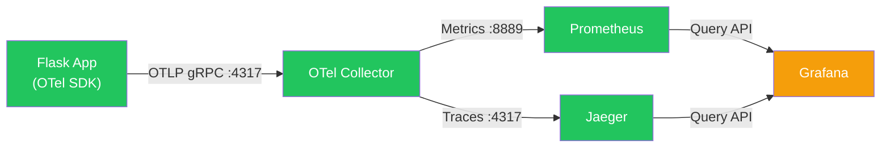

# 🔍 Monitoring Stack Audit — Flask-O-shop

## Service Health Summary

| Service | URL | Status | Verified |
|---------|-----|--------|----------|
| **Flask App** | `localhost:5000` | ✅ Running | Page title "Home - Flask-O-shop" returned |
| **OTel Collector** | `localhost:8889/metrics` | ✅ Running | Prometheus-format metrics being exported |
| **Prometheus** | `localhost:9090` | ✅ Running | Target `flask-app` health = **UP** |
| **Grafana** | `localhost:3000` | ✅ Running | v13.1.0, database OK |
| **Jaeger** | `localhost:16686` | ✅ Running | Service `flask-o-shop` registered |

---

## Data Flow Verification

### ✅ What's Working

1. **Flask → OTel Collector (OTLP)**: The app sends both metrics and traces via `opentelemetry-instrument` auto-instrumentation. Confirmed by `OTEL_EXPORTER_OTLP_ENDPOINT=http://otel-collector:4317`.

2. **OTel Collector → Prometheus exporter**: The collector exposes real Flask metrics at `:8889/metrics`. Confirmed metrics:
   - `http_server_duration_milliseconds` — request latency histogram (200, 304, 404 status codes)
   - `http_server_active_requests` — concurrent request gauge
   - `db_client_connections_usage` — SQLAlchemy pool stats (idle/used)
   - `target_info` — service identity (`flask-o-shop`, SDK v1.43.0)

3. **Prometheus scraping OTel Collector**: Target `otel-collector:8889` is **UP**, scraping every 5s, last scrape duration 2.6ms, no errors.

4. **OTel Collector → Jaeger (traces)**: Jaeger API returns `flask-o-shop` as a registered service — traces are flowing.

5. **Grafana datasource provisioning**: Prometheus and Jaeger datasources are auto-provisioned via [datasources.yaml](file:///home/aaxis-em/Desktop/Flask-O-shop/monitoring/grafana/provisioning/datasources/datasources.yaml).

### ⚠️ Issues Found

#### 1. No Grafana Dashboards Provisioned
Grafana has **no pre-provisioned dashboards**. The `monitoring/grafana/provisioning/` directory only has `datasources/` — there's no `dashboards/` directory with dashboard JSON files. This means users have to manually create dashboards after login.

#### 2. `docker-compose.yml` uses deprecated `version` key
The `version: '3.8'` key generates a warning. It's cosmetic but noisy.

---

## Recommended Fix: Add a Pre-Provisioned Grafana Dashboard

> [!IMPORTANT]
> Without a dashboard, Grafana is running but showing nothing useful. The fix below adds a dashboard provisioning config and a pre-built Flask monitoring dashboard.

Two files need to be created:
1. `monitoring/grafana/provisioning/dashboards/dashboards.yaml` — tells Grafana where to find JSON dashboards
2. `monitoring/grafana/provisioning/dashboards/flask-monitoring.json` — the actual dashboard

This gives you panels for:
- Request rate (requests/sec by route)
- Request latency (p50/p95/p99)
- Error rate (4xx/5xx)
- Active requests gauge
- DB connection pool usage
